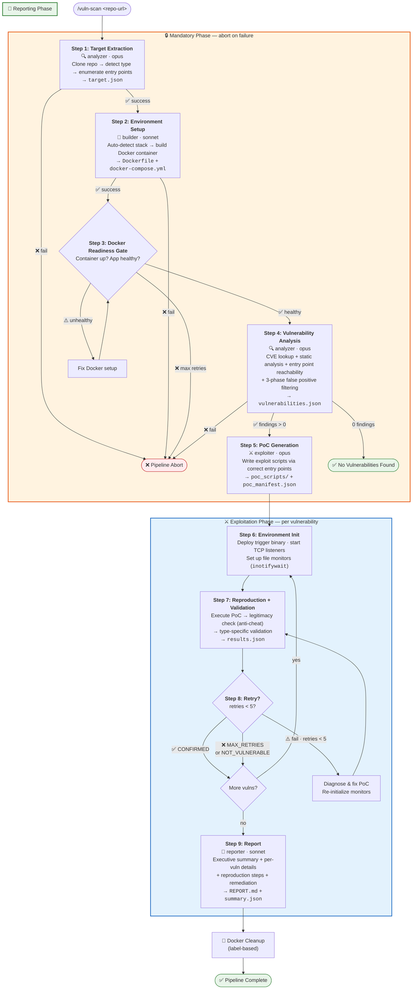

# Vuln-Analysis: Automated Security Vulnerability Verification Plugin

A Claude Code plugin for automated security vulnerability verification of open-source libraries, web applications, and CLI tools.

> **Authorization Notice**: This tool is designed for authorized security testing, penetration testing engagements, CTF competitions, and defensive security research only.

## Overview

This plugin automates the full vulnerability analysis lifecycle through a **9-step pipeline**:

1. **Target Extraction** — Clone repo, analyze project type, enumerate all public entry points
2. **Environment Setup** — Auto-detect stack, build Docker container, verify health
3. **Docker Readiness Gate** — Verify target app runs correctly inside Docker before proceeding
4. **Vulnerability Analysis** — Scan for CVEs + static analysis with entry point reachability assessment
5. **PoC Generation** — Write exploit scripts targeting the Docker container via correct entry points
6. **Environment Init** — Deploy trigger binary, start TCP listeners, set up file monitors
7. **Reproduction + Validation** — Execute PoCs, legitimacy check (anti-cheat), type-specific validation
8. **Retry Loop** — Auto-fix failures, re-initialize monitors (up to 5 retries per vulnerability)
9. **Report** — Generate comprehensive Markdown report with copy-paste-ready reproduction steps

**Abort conditions**: Steps 1-4 are mandatory. If any fails, the pipeline aborts.

## Pipeline Flow



## Key Features

### Entry Point Reachability

A vulnerability is only valid if an attacker can **reach** it through a public entry point. The pipeline enforces this at every stage:

| Target Type | Valid Entry Points |
|-------------|-------------------|
| **Library** | Public API functions/classes/methods |
| **Web App** | HTTP routes, API endpoints, WebSocket handlers |
| **CLI Tool** | CLI commands and arguments |

Unreachable vulnerabilities (private functions, test files, dead code) are automatically excluded.

### Anti-Cheat Validation

Every PoC undergoes a **legitimacy check** to ensure it exploits through the target application's vulnerable code path — not by directly calling system APIs. This prevents false confirmations.

### Docker-Only Execution

All PoC scripts and Python execution happen **inside Docker containers**. Nothing runs on the host except Docker management commands. All Docker resources are labeled with `vuln-analysis.pipeline-id` for safe, targeted cleanup.

## Supported Vulnerability Types

| Type Key | Description | Validator |
|----------|-------------|-----------|
| `rce` | Remote Code Execution | `skills/validate-rce/` |
| `ssrf` | Server-Side Request Forgery | `skills/validate-ssrf/` |
| `insecure_deserialization` | Insecure Deserialization | `skills/validate-insecure-deserialization/` |
| `arbitrary_file_rw` | Arbitrary File Read/Write | `skills/validate-arbitrary-file-rw/` |
| `dos` | Denial of Service | `skills/validate-dos/` |
| `command_injection` | Command Injection | `skills/validate-command-injection/` |

### Code Security Review

The plugin includes a mandatory 3-phase code audit process at `skills/code-security-review/`:

1. **Audit** — Context research, comparative analysis, vulnerability assessment
2. **Filter** — Hard exclusion regex, AI filtering (19 rules), precedent check (17 rules), confidence scoring (threshold >= 7)
3. **Report** — Filter summary table, detailed findings, excluded findings list

## Architecture

### Agents

| Agent | Model | Role |
|-------|-------|------|
| `orchestrator` | opus | Pipeline coordinator — sequences steps, manages state, enforces invariants |
| `analyzer` | opus | Target extraction (Step 1) + vulnerability analysis (Step 4) |
| `builder` | sonnet | Docker environment setup (Step 2) |
| `exploiter` | opus | PoC generation (Step 5) + execution + retry (Steps 6-8) |
| `reporter` | sonnet | Report generation (Step 9) |

### Documentation Hierarchy

```
CLAUDE.md                    ← Root rules (safety invariants, conventions)
  ├── agents/*/AGENT.md      ← Agent-specific workflows (reference CLAUDE.md for shared rules)
  ├── skills/*/SKILL.md      ← Detailed operational guides (authoritative per topic)
  └── templates/*.md         ← Lightweight entry points (reference skills/agents)
```

Each piece of information has **one authoritative location**. Templates are thin references; skills contain full methodology.

## Directory Structure

```
vuln-analysis/
├── CLAUDE.md                              # Project rules and conventions
├── README.md
├── requirements.txt
├── .gitignore
│
├── commands/                              # Slash commands
│   ├── vuln-scan.md                       #   /vuln-scan — full 9-step pipeline
│   ├── env-setup.md                       #   /env-setup — Docker env only
│   ├── poc-gen.md                         #   /poc-gen — generate PoCs
│   ├── reproduce.md                       #   /reproduce — run reproduction
│   └── report.md                          #   /report — generate report
│
├── skills/                                # Skill modules (11 skills)
│   ├── target-extraction/SKILL.md         #   Step 1: target + entry point analysis
│   ├── environment-builder/               #   Step 2: modular env setup
│   │   ├── SKILL.md                       #     Detect → Route → Build → Verify → Document
│   │   ├── app/                           #     Language-specific (python, node, java, docker-compose)
│   │   ├── db/                            #     Database provisioning (postgres, mysql, redis, mongo)
│   │   ├── helpers/                       #     Network check, image check, port isolation
│   │   ├── output/                        #     ENVIRONMENT_SETUP.md template
│   │   └── scripts/                       #     Shell automation (health check, env setup)
│   ├── vulnerability-scanner/SKILL.md     #   Step 4: vuln discovery with filtering
│   ├── code-security-review/              #   3-phase code audit
│   │   ├── SKILL.md                       #     Mandatory audit → filter → report
│   │   └── resources/                     #     Filtering rules, exclusion patterns
│   ├── poc-writer/SKILL.md                #   Step 5: PoC script patterns
│   └── validate-*/SKILL.md               #   6 type-specific validators (Steps 7-8)
│
├── agents/                                # Agent definitions
│   ├── orchestrator/AGENT.md              #   Pipeline coordinator (opus)
│   ├── analyzer/AGENT.md                  #   Target + vuln analysis (opus)
│   ├── builder/AGENT.md                   #   Docker env builder (sonnet)
│   ├── exploiter/AGENT.md                 #   PoC execution + retry (opus)
│   └── reporter/AGENT.md                  #   Report generation (sonnet)
│
├── templates/                             # Lightweight prompt templates
│   ├── validation_framework.md            #   Unified PoC validation framework (authoritative)
│   └── *.md                               #   Thin references to skills/agents
│
├── core/                                  # Python framework
│   ├── pipeline.py                        #   Pipeline orchestrator
│   ├── runner.py                          #   PoC script runner
│   ├── validators/                        #   Base + 6 concrete validators
│   ├── reporters/                         #   Markdown + JSON report generators
│   └── runners/                           #   Docker manager
│
└── examples/
    ├── dockerfiles/                        #   Example Docker configs
    ├── poc_scripts/                        #   One example PoC per vuln type (6 scripts)
    └── poc_manifest.example.json
```

## Installation

### Via Claude Code Plugin (Recommended)

```bash
claude plugin marketplace add shaobaobaoer/vuln-analysis-with-validation-plugin
claude plugin install vuln-analysis@vuln-analysis-with-validation-plugin
```

### Manual Installation

```bash
git clone https://github.com/shaobaobaoer/vuln-analysis-with-validation-plugin.git \
    ~/.claude/plugins/vuln-analysis
```

### Runtime Dependencies

- Docker and docker-compose
- Python 3.12+
- [`uv`](https://github.com/astral-sh/uv) (Python package manager — used inside Docker containers)

## Quick Start

### Full Scan

```
/vuln-scan https://github.com/example/vulnerable-app
```

This runs the complete 9-step pipeline and produces all artifacts in `workspace/`.

### Individual Steps

```
/env-setup https://github.com/example/vulnerable-app
/poc-gen
/reproduce
/report
```

### Running PoC Scripts Manually

All PoC execution MUST happen inside Docker:

```bash
cd workspace
docker-compose up -d

# Copy PoC into container and execute (NEVER run python3 on the host)
docker cp poc_scripts/poc_rce_001.py <container>:/app/
docker exec <container> python3 /app/poc_rce_001.py --target http://localhost:8080 --timeout 30

docker-compose down -v
```

### Using the Python Framework

```python
from core.pipeline import VulnPipeline

pipeline = VulnPipeline(
    repo_url="https://github.com/example/vulnerable-app",
    workspace="./workspace"
)
pipeline.run()
```

## Pipeline Output

```
workspace/
├── target.json              # Step 1: target metadata + entry_points[]
├── Dockerfile               # Step 2: generated Dockerfile
├── docker-compose.yml       # Step 2: compose config
├── vulnerabilities.json     # Step 4: findings with entry_point reachability
├── poc_manifest.json        # Step 5: PoC script manifest
├── poc_scripts/             # Step 5: generated PoC scripts
├── results.json             # Step 7-8: reproduction results
├── pipeline_state.json      # Pipeline progress tracking
└── report/
    ├── REPORT.md            # Step 9: full vulnerability report
    └── summary.json         # Step 9: machine-readable summary
```

## Validation Status Codes

| Status | Exit Code | Meaning |
|--------|-----------|---------|
| `CONFIRMED` | 0 | Vulnerability successfully reproduced |
| `NOT_REPRODUCED` | 1 | Exploit failed, vulnerability not triggered |
| `PARTIAL` | 1 | Some indicators present but not fully exploitable |
| `ERROR` | 2 | Script execution error |
| `MAX_RETRIES` | 1 | Failed after 5 retry attempts |

## Safety Invariants

1. **Docker-only execution** — ALL PoC scripts run against Docker containers, NEVER on the host
2. **All Python inside Docker** — Use `docker exec` for all Python execution
3. **Use `uv`** — All Python dependency management uses `uv` (never pip/conda directly)
4. **Mandatory Steps 1-4** — Pipeline aborts if any of the first 4 steps fail
5. **No auto-fix** — The pipeline reports vulnerabilities but never patches the target code
6. **Local-only builds** — Docker images are built and run locally only, never pushed to registries
7. **Label-based cleanup** — All Docker resources labeled with `vuln-analysis.pipeline-id` for safe cleanup

## Security & Ethics

This tool is intended solely for:
- Authorized penetration testing engagements
- CTF competitions and security training
- Defensive security research
- Open-source security auditing

Never use this tool against systems without explicit written authorization.
